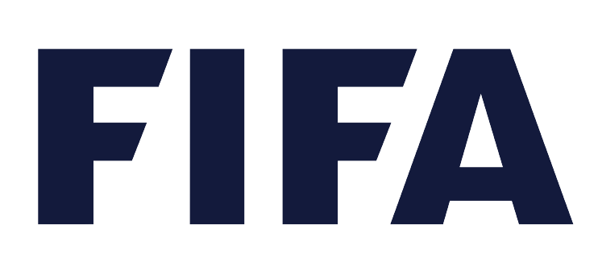

  
   

  <h3><b>FIFA Seminar (Microverse First Capstone Project)</b></h3>

# 📗 Table of Contents

- [📖 About the Project](#about-project)
  - [🛠 Built With](#built-with)
    - [Tech Stack](#tech-stack)
    - [Key Features](#key-features)
  - [ Video Description Link](#video-description)
  - [🚀 Live Demo](#live-demo)
- [💻 Getting Started](#getting-started)
  - [Setup](#setup)
  - [Install](#install)
  - [Usage](#usage)
  - [Run tests](#run-tests)
  - [Deployment](#triangular_flag_on_post-deployment)
- [👥 Authors](#authors)
- [🔭 Future Features](#future-features)
- [🤝 Contributing](#contributing)
- [⭐️ Show your support](#support)
- [🙏 Acknowledgements](#acknowledgements)
- [❓ FAQ](#faq)
- [📝 License](#license)

# 📖 FIFA Seminar (Microverse First Capstone Project) 

**FIFA Seminar** is a website for an arbitrary event of FIFA promoting diversity and inclusion in and through football around the world.

## 🛠 Built With 

### Tech Stack 

  
Front-End

  <ul>
    <li><a href="https://html.com/">HTML</a></li>
  </ul>
  <ul>
    <li><a href="https://developer.mozilla.org/en-US/docs/Web/CSS">CSS</a></li>
  </ul>
  <ul>
    <li><a href="https://www.javascript.com/">JavaScript</a></li>
  </ul>

### Key Features 

- **This website is responsive**
- **The website uses a number of JavaScript functions and events to increase its functonality**

(<a href="#readme-top">back to top</a>)

## Video Description 

- [Video Description Link](https://www.loom.com/share/07cc208a7c4d4159becad32c912fec0a)

(<a href="#readme-top">back to top</a>)

## 🚀 Live Demo 

- [Live Demo Link](https://sameedmohsin28.github.io/Fifa-Seminar-First-Capstone/home.html)

(<a href="#readme-top">back to top</a>)

## 💻 Getting Started 

To get a local copy up and running, follow these steps.

### Setup

Clone this repository to your desired folder through GitHub Desktop.

### Install

Install this project with WinRar.

### Usage

To run the project, use VS Code Live Server plugin.

### Run tests

To run tests, run the following command:

npx stylelint "**/*.{css,scss}"
        
npx eslint .

### Deployment

You can deploy this project using GitHub Pages.

(<a href="#readme-top">back to top</a>)

## 👥 Author 

- GitHub: [@githubhandle](https://github.com/sameedmohsin28/)
- Twitter: [@twitterhandle](https://twitter.com/SameedMohsin22)
- LinkedIn: [LinkedIn](https://www.linkedin.com/in/sameed-mohsin-538792180/)

(<a href="#readme-top">back to top</a>)

## 🔭 Future Features 

- [ ] **A credits page might be added later to acknowledge the sources used in making this project.**

(<a href="#readme-top">back to top</a>)

## 🤠Contributing 

Contributions, issues, and feature requests are welcome!

Feel free to check the [issues page](https://github.com/sameedmohsin28/Fifa-Seminar-First-Capstone/issues).

(<a href="#readme-top">back to top</a>)

## ⭐️ Show your support 

If you like this project please give me an endorsement on LinkedIn.

(<a href="#readme-top">back to top</a>)

## 🙠Acknowledgments 

- The design template implemented in this project is designed by Cindy Shin in Behance. The template can be viewed [here](https://www.behance.net/adagio07).

- The logo of this website is a property of .

- I do not own any of the pictures used in this project. The credits of the pictures are due to the sources they have been taken from.

(<a href="#readme-top">back to top</a>)

## ❓ FAQ 

- **Is there any back-end technology used in making this website?**

  - No! This website is purely made with front-end technologies.

- **Is the event which the website is about to be held in real?**

  - No! This is just an arbitrary event website made to showcase my coding skills. No such event is taking place in real. This website is not associated in any means and has nothing to do with FIFA or the entities mentioned in the website.

(<a href="#readme-top">back to top</a>)

## 📠License 

This project is [MIT](https://github.com/sameedmohsin28/Fifa-Seminar-First-Capstone/blob/main/LICENSE) licensed.

(<a href="#readme-top">back to top</a>)
